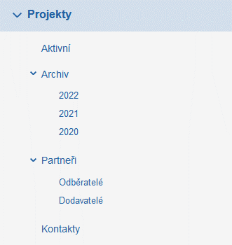

# Modul projekty

Modul projekty se skládá z několika složek, jejich obsahy jsou integrovány a aktivně využity v projektech ať už jde o aktivní, plánované nebo i archivované projekty. 

První část složek modulu Projekty se skládá ze složek: aktivní a archiv vč. jednotlivých ročníků, ve kterých jsou projekty archivovány. Všechny ukončené a uzavřené projekty jsou vedeny v archivu. Aktivní, plánované, rozpracované nebo i odložené projekty najdete ve složce Aktivní.

Složka Partneři a Kontakty jsou vzájemně provázány. Jde o CRM pro modul Projekty, ve které spravujete všechny kontakty na odběratele a dodavatele. Složku i její podsložky si můžete přejmenovat dle vlastních potřeb, stejně tak si můžete vytvořit další CRM podsložky a vést tak například černou listinu („black-list“) partnerů apod. Složka Kontakty pak odkazuje na jednotlivé fyzické osoby. Tyto fyzické osoby můžete vést samostatně, stejně tak je díky funkci „souvislosti“ můžete spárovat s kartou partnera ve složce „Odběratelé“ či „Dodavatelé“, archivovat veškerou komunikaci jednotně a tak využít Modul projekty na maximum.
