# Zakládání projektu 

## Zahajení

Pro založení nového projektu nejprve v pravé horní části najděte tlačítko symbolizující tři vodorovné čáry a po jejím stisknutí se Vám zobrazí lišta na pravé části obrazovky. Na této liště v podsekci „Nové…“ vyberte „Projekt“ a klikněte na něj.

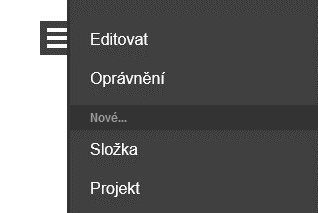

## Nastavení projektu

Pokud jste správně uskutečnili popisované kroky, otevřel se Vám formulář, který slouží k základnímu nastavení celého projektu. Můžete vyplnit všechny nebo jen Vámi vybrané položky a zbylé nechat prázdné, ať už z důvodu, že je nevyužijete nebo potřeby nejprve si informace ověřit a následně je až uvést. Úvodní nastavení projektu Vám následně vytvoří kartu projektu, se kterou již můžete aktivně pracovat. Ke každé položce se můžete vrátit a můžete ji i zpětně upravovat.

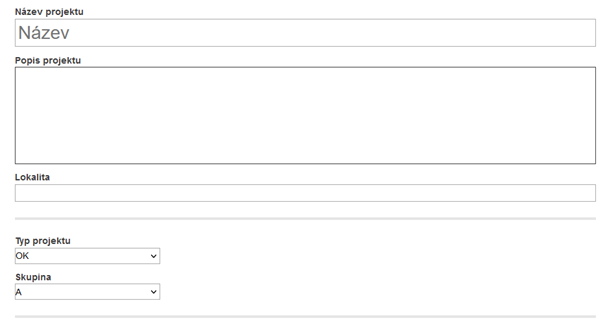

V první části „Název projektu“ uveďte název nebo případně vlastní pojmenování či kategorizování projektu, podle kterého si projekt budete pamatovat a podle kterého se Vám projekty budou seřazovat. Např. 2023-01-001_Řízení dodávky potravin.
U druhého okna „Popis projektu“ již máte více prostoru pro text a můžete zde uvést všechny dostupné informace o projektu pro přiblížení kontextu projektu, doporučení k projektu a řadu dalšího dle Vašich potřeb.

V sekci Lokalita pak uvedete místo, kde je projekt realizován. 

Na základě předem vyspecifikovaných parametrů si můžete projekt následně zařadit pod určitý „Typ projektu“ a současně přiřadit konkrétní „Skupinu“. Tyto dvě položky jsou vydefinovány předem a nabízí konečný výčet možností, ze kterého si vyberete vždy jen jednu. Po kliknutí na jednotlivé položky se Vám otevře rozbalovací lišta a z ní pak vyberete konkrétní položku.

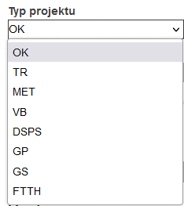 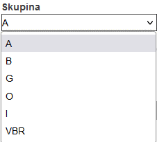

Následuje další sekce, která Vám stanoví klíčové milníky projektu a to „začátek“ a „konec“. V této sekci najdete rozdělení na část smluvní a část realizační a ke každé můžete určit termín „Zahájení“ a termín „Konečný“ respektive „Uzavření projektu“.

## Termíny

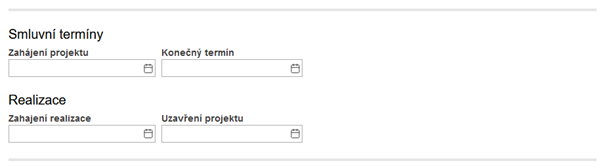

Po kliknutí na konkrétní buňku termínu se Vám otevře samostatný kalendář, ve kterém snadno nastavíte konkrétní rok, měsíc, den a případně i čas. Pro změnu měsíce a roku využijte šipek, které najdete před a za názvem měsíce a roku, který se Vám aktuálně zobrazuje.

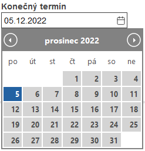

## Investor, objednatel, dodavatelé

Následující část se věnuje zainteresovaným stranám na projektu. Zde můžete vyplnit jen ty osoby, které jsou platné pro Váš konkrétní projekt. V případě, že např. nemáte žádné dodavatele a celý projekt řešíte interně a interními službami, pak toto pole zůstane nevyplněno. První tři, tedy „Investor“, „Objednatel“, „Dodavatelé“, jsou propojeni na „Partneři“ a „Kontakty“, které si vytváříte a spravujete v odlišné složce. 

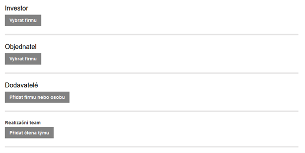

Položka Investor označuje konkrétní subjekt, který je hlavním sponzorem projektu, pro kterého je projekt realizován a který má coby budoucí uživatel významný zájem o produkt projektu a stejně tak celý průběh projektu. 

Objednavatel je přímý klient Vašeho projektu, který projekt objednal. Zpravidla se objevuje v momentě, kdy jste dodavatelem některému subjektu, který realizuje zakázku či projektu pro jiného klienta. V podobném scénáři pak „subjekt“ je „Objednatel“ a jiný klient je „Investor“. Samozřejmě stejně tak platí, že „Investor“ a „Objednatel“ může být jedna a ta stejná osoba. 

Dodavatelé na rozdíl od položek výše Vám umožňují přidat více položek a to jak právnické osoby, stejně tak i osoby. Tedy tato položka je propojena jak na složku „Partneři“, tak i „Kontakty“ modulu projektového CRM. Zde tedy můžete přidat naprosto všechny osoby Vašich dodavatelů, se kterými Vy a Vaši kolegové přijdete v kontakt na projektu.

První tři položky (Investor, Objednatel, Dodavatelé) vybíráte totožně. Po kliknutí na položku Vybrat/Přidat se Vám otevře nové okno, ve kterém postupně projdete cestou a naleznete Vámi hledanou firmu nebo osobu.

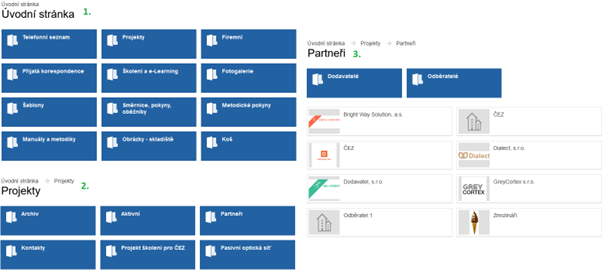

## Realizační team

Poslední položkou v seznamu zainteresovaných stran projektu je položka „Realizační team“. Zde máte po kliknutí na položku „Přidat člena týmu“ dostupné všechny kolegy, kteří používají rozhraní pro řízení projektů. Můžete vybrat jednoho nebo i více uživatelů. 

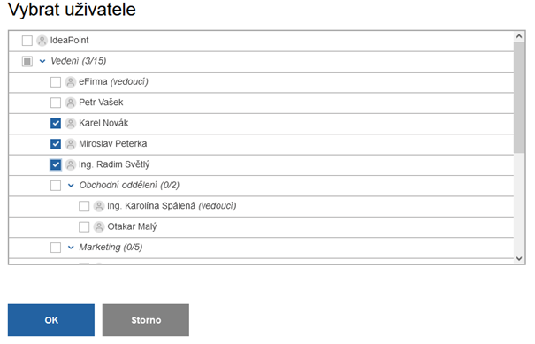

Jakmile jste s výběrem spokojeni, každému vybranému členu následně přiřadíte roli na projektu (vedoucí projektu, projektant). Pokud jste na někoho zapomněli, tlačítko „Přidat člena týmu“ můžete využít i opakovaně. V případě, že jste vybrali i někoho, kdo se na projektu nakonec účastnit nebude, pak jej můžete snadno odstranit z projektu za pomoci kliknut na tlačítko „křížek“, které najdete vpravo za funkcí u každého člena realizačního týmu.

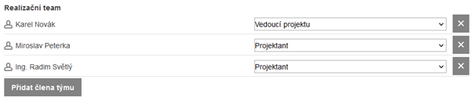

## Milníky

Na závěr nastavení projektu si přidáváte všechny známé milníky. Milníky se přidávají od posledního k prvnímu a přidáte je po kliknutí na tlačítko „Přidat milník“.

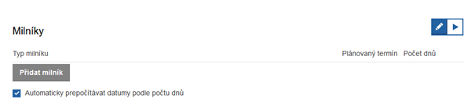

Výchozí termín milníku je stanoven na základě termínu, který jste uvedli jako „Konečný termín“ v sekci „Smluvní termíny“. Po kliknutí na položku „Přidat milník“ se Vám otevře okno s výčtem, který jste si definovali v úvodu. Pokud Vám ani jeden typ milníku nevyhovuje, na konci výčtu naleznete milník s názvem „obecný“, který mi měl splňovat základní parametry. 

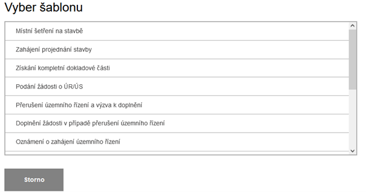

Naprosto všechny milníky si poté, co si je vyberete, můžete přejmenovat dle Vašich potřeb a potřeb projektu. Stejně jako název milníku si můžete upravit i počet dnů a tedy plánovaný termín. Milníky přidáváte, dokud nejsou uvedeny všechny bez nutnosti průběžného ukládání. Milníky můžete krom tlačítka „Přidat milník“ přidat i po kliknutí na tlačítko „plus“, které naleznete na konci řádku každého milníku. Pokud se rozhodnete, že potřebujete některý z milníků odstranit, můžete tak učinit kliknutím na tlačítko „křížek“ vpravo u milníku.

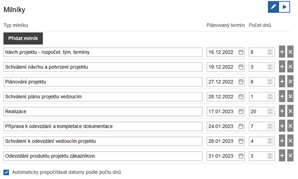

Vpravo nahoře máte dvě tlačítka „tužka“ a „spusť“. Tlačítko tužka Vám rozhraní milníku uvedeno do typu nastavování, ve kterém můžete milníky přidat a odebrat, dále pak jim přiřazovat výchozí termíny a počet dní než milníky nastanou. Tlačítko „spusť“ převádí rozhraní milníků do procesu. Zde již milníky přidávat ani upravovat nemůžete, ale již s milníky pracujete po stránce plnění termínu, stavu (plánovaný, zpracovávaný, provedený, archivovaný) a stejně tak zde uvádíte, zda milníky byly splněny včas nebo s prodlením apod. Po změně stavu na „Provedený“ pak uvádíte „Datum provedení“ milníku. Datum přidáváte stejně, jako jste přidávali termínu v úvodu při stanovování začátku a konce projektu.

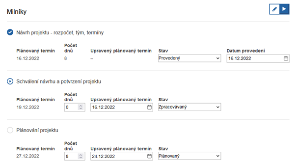